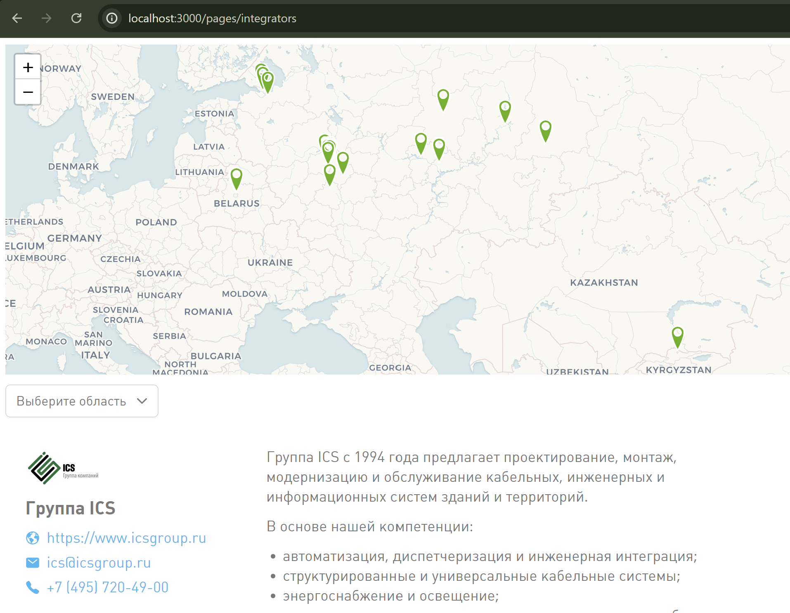

# Wiren Board website
Репозиторий содержит в себе контент для сайта https://wirenboard.com.

Инструкции по редактированию контента:
- [Описание синтаксиса](/doc/syntax.md);
- [Произвольные страницы](/doc/page.md);
- [Партнеры](./doc/partners.md);
- [Интеграторы](./doc/integrators.md);
- [Вакансии](./doc/jobs.md);
- [Статьи](./doc/articles.md).
- [Внедрения](./doc/solutions.md).

## Онлайн-редактор
Если вам надо добавить интегратора или внести небольшие исправления в существующие страницы, это удобно делать через веб-интерфейс Github. Документация на английском:
- [управление файлами](https://docs.github.com/ru/repositories/working-with-files/managing-files);
- [создание и удаление веток](https://docs.github.com/en/pull-requests/collaborating-with-pull-requests/proposing-changes-to-your-work-with-pull-requests/creating-and-deleting-branches-within-your-repository);
- [создание пуллреквестов](https://docs.github.com/en/pull-requests/collaborating-with-pull-requests/proposing-changes-to-your-work-with-pull-requests/creating-a-pull-request).

Общий алгоритм такой:
1. Вносите изменения: правите файлы или добавляете новые.
2. Сохраняете их с помощью кнопок _Commit changes…_ в отдельную веточку, например, `feature/added-setpoint` или `bugfix/fix-bcs-description`.
3. Как всё будет готово, создаёте пуллреквест и заполняете форму, выбираете ревьювером matveevrj (замещает aadegtyarev). Создать пуллреквест можно сразу при сохранении изменений в каком-либо файле или на странице [Pull requests](https://github.com/wirenboard/website/pulls).
4. Отправляете пуллреквест на ревью и ждёте обратную связь от коллег.
5. Если есть, что поправить, коллеги оставят комментарии. Когда по мнению коллег всё будет хорошо, они одобряют правки (аппрувят, approve).
6. Вы вливаете изменения (мержите, Merge) через кнопку _Squash and merge_. Если комментарий при вливании будет большой и непонятный — перепишите его.

**Деплой в продакшн.** После вливания изменений сайт будет собран и опубликован по адресу https://wirenboard.com. Следить за процессом сборки можно в разделе [Actions](https://github.com/wirenboard/website/actions).

## Офлайн редактор

Предполагается, что у вас установлен Git, редактор VSCode с [плагином подсветки компонентов Nuxt](https://marketplace.visualstudio.com/items?itemName=Nuxt.mdc) и вы умеете этим пользоваться. В VSCode есть простой предпросмотр, но для сложных изменений рекомендуем запускать сайт локально и смотреть страницу целиком с учётом вставленных изображений, компонентов и т.п.

Сам процесс создания новых веток, PR и прочего описан в документе [Процесс разработки проектов Wiren Board с использованием Git](https://github.com/wirenboard/codestyle/blob/master/workflow.md).

**Деплой в продакшн.** После вливания изменений (мержа, merge) сайт будет собран и опубликован по адресу https://wirenboard.com. Следить за процессом сборки можно в разделе [Actions](https://github.com/wirenboard/website/actions).

## Как запустить сайт локально
Запуск сайта в браузере позволит вам видеть все внесенные изменения в реальном времени — страница будет обновляться после каждого сохранения файла. Для этого выполните следующие шаги:

- Клонируйте этот репозиторий:
  ```
  https://github.com/wirenboard/website.git
  ```
- Установите NodeJS. Скачайте и установите [NodeJS](https://nodejs.org/en/download/prebuilt-installer) для вашей операционной системы.
- Установите пакетный менеджер [pnpm](https://pnpm.io/installation). В процессе установки подвтерждайте предложенные варианты.
- Установите зависимости проекта. Перейдите в корневую директорию проекта и выполните команду:
    ```bash
    pnpm install
    ```
- Запустите локальный сервер, выполнив команду:
    ```bash
    pnpm run dev
    ```

Просмотр будет доступен в браузере по адресу `http://localhost:3000`. Не забудьте ввести в адресную строку url редактируемой страницы, например `http://localhost:3000/ru/contents/articles`.

Отображаться будет только контент, без остального содержимого сайта (навигации, футера и пр.).



Чтобы посмотреть, какой версии в github соответствует текущая версия сайта, можно использовать адрес `http://localhost:3000/version.txt`.
Это также будет работать, если сайт развёрнут целиком, как на https://wirenboard.com : `https://wirenboard.com/version.txt`.

По этому адресу будет доступен такой текстовый файл:

```
Base version: unknown
External version: main@d9faf525
```

В данном примере `main@d9faf525` — это версия сайта, которая соответствует текущему состоянию в репозитории. `main` - ветка, `d9faf525` - хэш коммита.
