# Как вносить правки

## Подготовка
Если вы впервые вносите правки, вам надо [клонировать репозиторий себе на компьютер](git_vscode.md). 

В остальных случаях просто откройте папку с репозиторием (website) в редакторе VSCode.

[Шпаргалка по Git](images/git_add_content/git-branches-2.png)

## Переключение на main
Перед внесением правок надо переключиться на ветку `main` и получить её текущее состояние с сервера:
1. Переключитесь на ветку `main`
    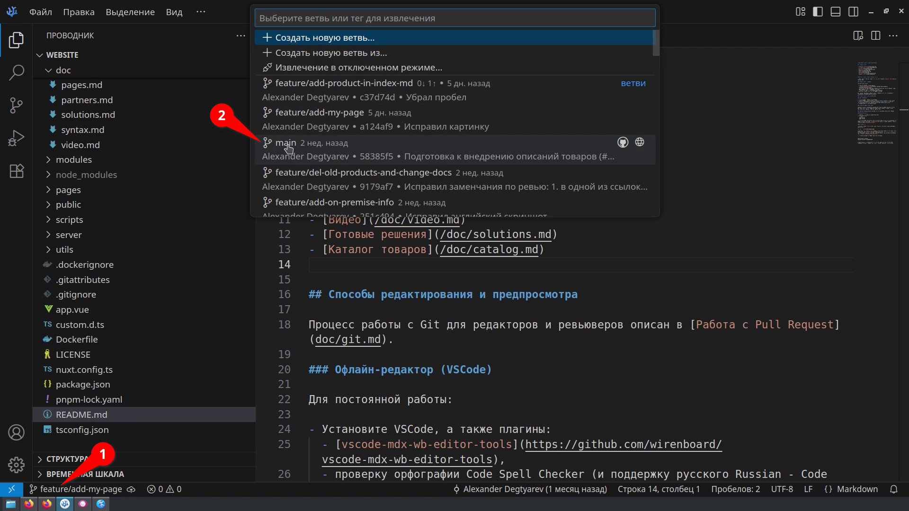
2. Получите изменения с сервера, если они есть. В некоторых случаях может быть активна кнопка *Синхронизация* — тогда нажимайте на неё
    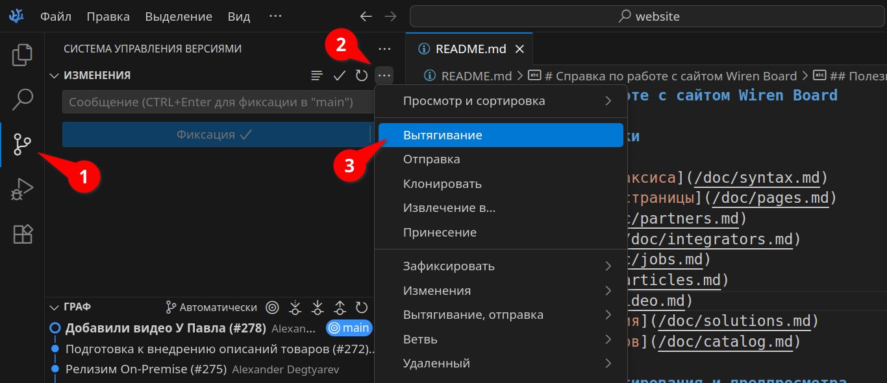

## Создание новой ветки
Теперь надо создать новую ветку в которой будем работать:
1. Выберите в меню *Извлечение в*
    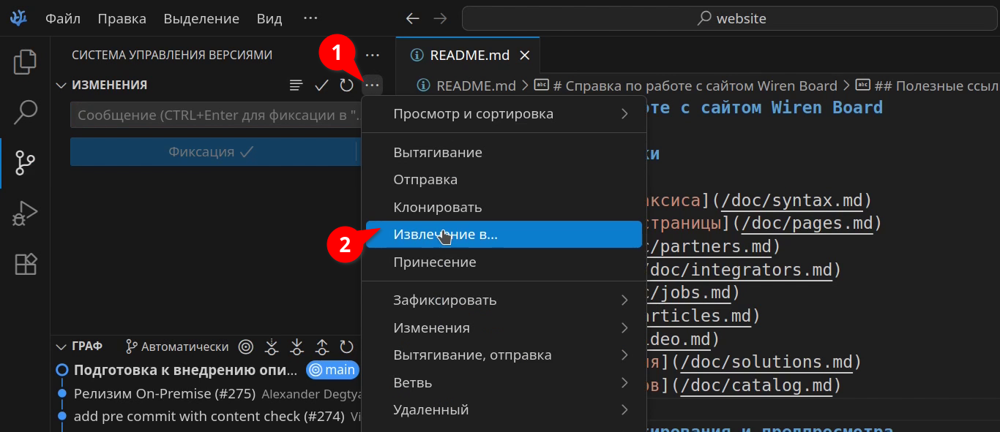
2. Далее *Создать новую ветвь…*
    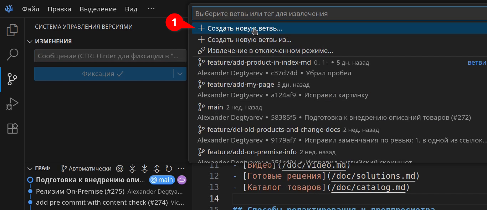
3. Задайте понятное имя с префиксом: `feature/` — полезные изменения, `bugfix/` — исправления ошибок
    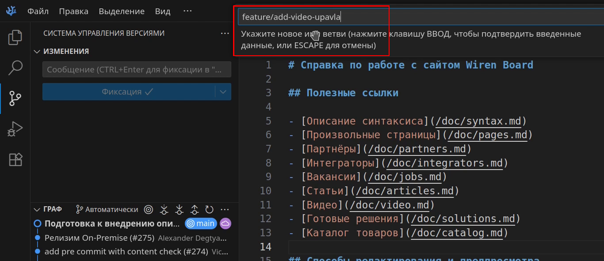
4. VSCode автоматически переключится на новую ветку, убедитесь что это так
    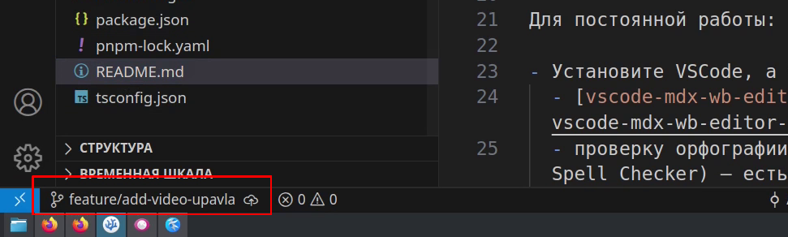    

## Куда вносить правки
Определите в какую часть репозитория будете вносить правки. Для этого откройте файл [README.md](../README.md) в корне репозитория, найдите нужный тип контента и перейдите по ссылке в документ с описанием расположения.
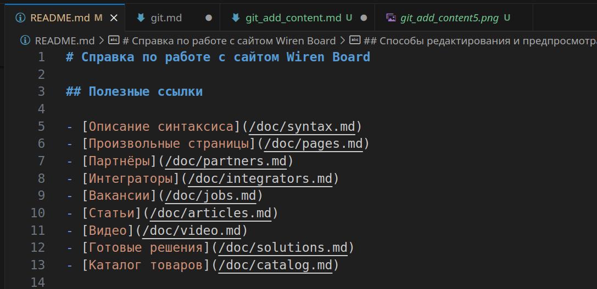

## Изменения и предпросмотр
Далее добавьте контент: папки, картинки, текстовые md-файлы и т.п. Используйте для этого встроенный в VSCode проводник. В нём можно создавать папки и файлы, в него можно перетаскивать мышкой файлики снаружи:
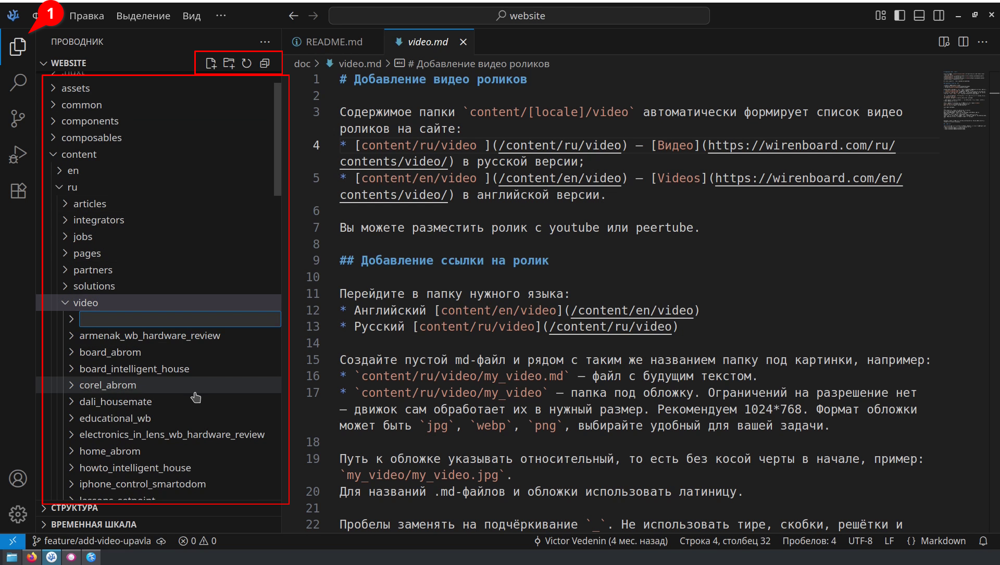

В процессе удобно использовать предпросмотр, который вызывается командой *Show MDX WB Preview*:
1. Откройте палитру команд клавишами *Ctrl + Shift + P* или в меню *Вид → Палитра команд* и введите mdx, затем выберите *Show MDX WB Preview*
    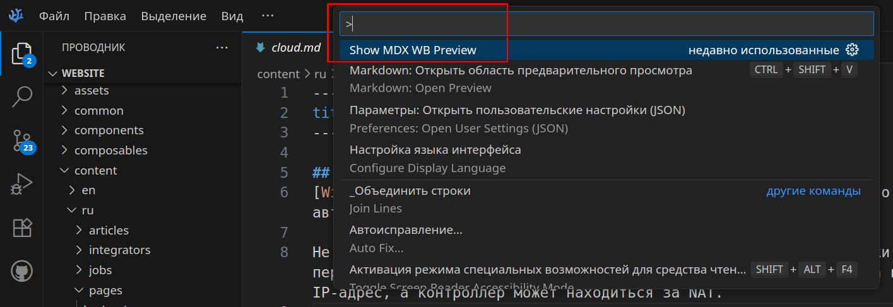
2. Справа от документа откроется окно предпросмотра. Предпросмотр доступен для всех md-файлов проекта, обновляется после сохранения файла
    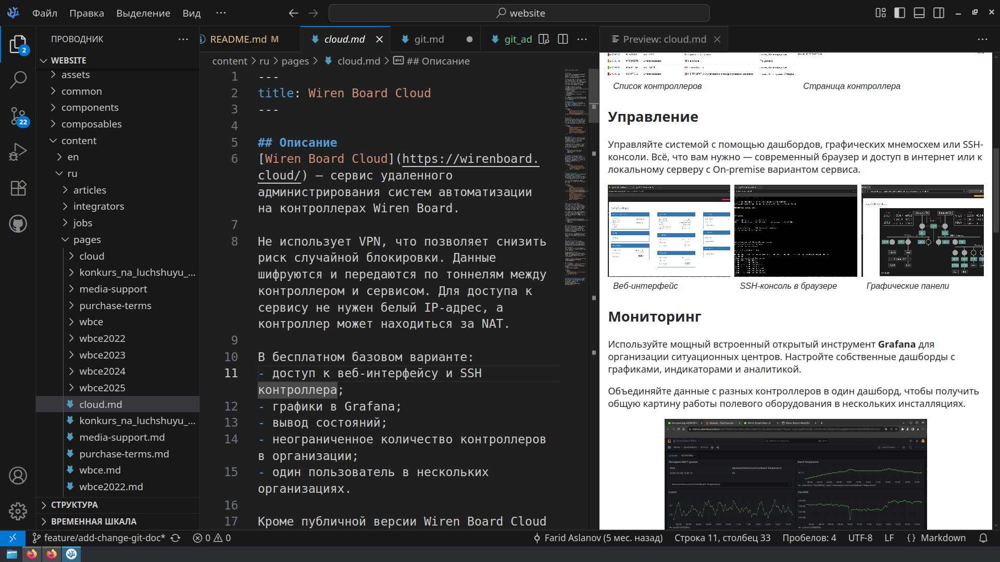

## Фиксация изменений
Когда вы внесли и проверили изменения, надо их зафиксировать и вашу ветку на сервер:
1. Откройте инструмент работы с версиями, проверьте, что в списке *Изменения* нет лишнего и нажмите *Фиксация*
    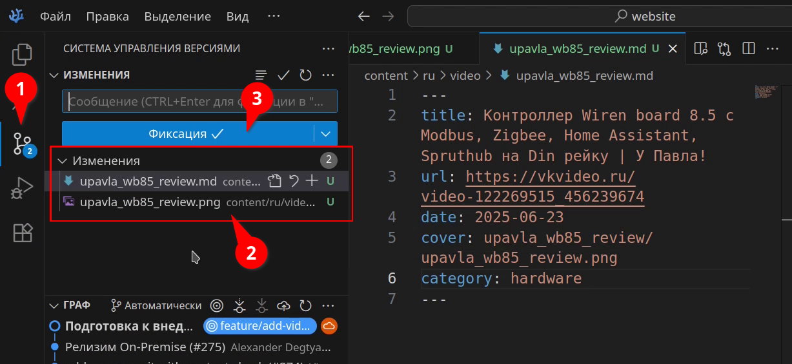
2. Ответьте Да на вопрос о прямой фиксации изменений
    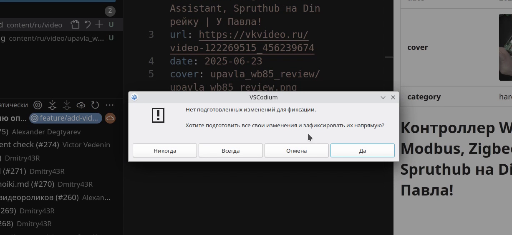
3. Введите описание изменений и нажмите на птичку в углу окна. Если вы передумали, закройте окно *COMMIT_EDITMSG* и изменения не будут приняты
    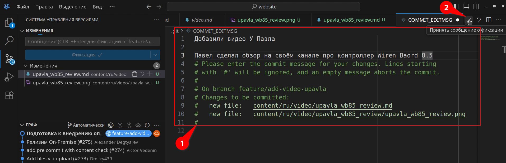
4. Теперь изменения есть в ветке, это видно по названия коммита в поле *Граф*, отправьте их на сервер кнопкой *Опубликовать Branch*
    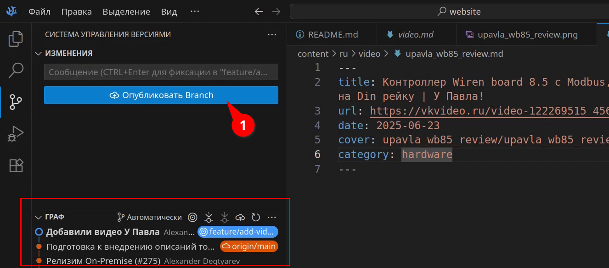

## Запрос ревью правок через Pull Request
Изменения ушли на сервер, теперь можно показать их коллегам. Для этого есть *Pull Request* (PR):
1. Перейдите в браузере в наш репозиторий сайта и нажмите появившуюся кнопку *Compare & pull request*. Кнопка появляется если на сервере есть ваша ветка и к ней нет PR. Если вы уже открывали PR для вашей ветки, ищите его во вкладке *Pull Requests*
    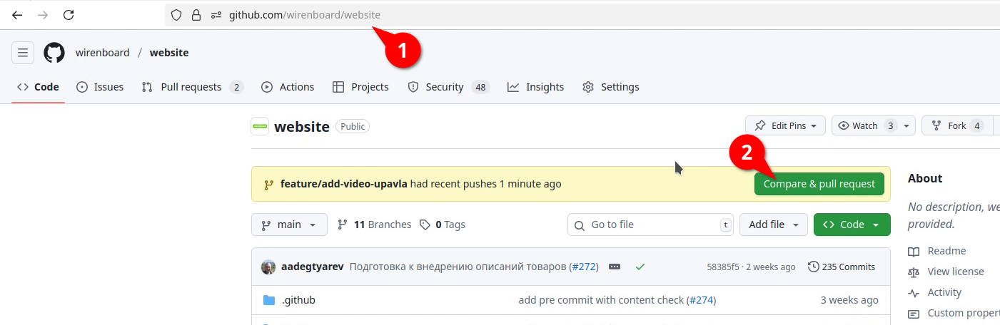
2. Задайте для PR заголовок, описание, выберите команду ревьюверов и нажмите кнопку *Create pull request*
    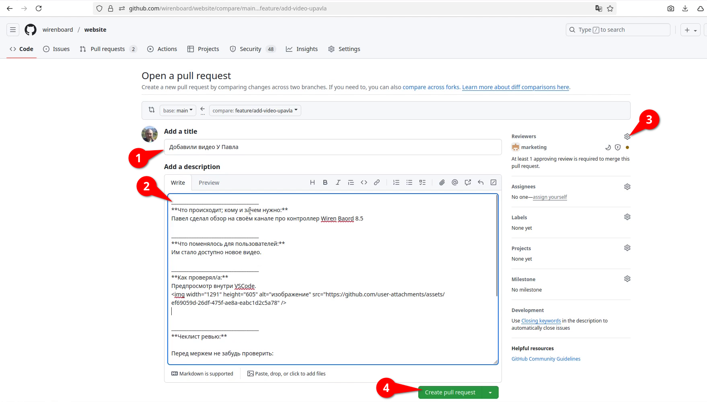

Если PR не приняли, надо отработать комментарии:
1. Найти комментарии на странице PR, выглядят они так
    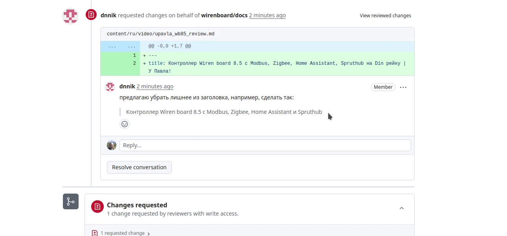
    тут же можно обсудить предлагаемые ревьювером изменения.
2. Перейти в VSCode и в той же веточке на которую открывали PR внести нужные изменения.
3. Зафиксировать изменения и отправить на сервер.
4. После отправки они добавятся в ваш PR и ревьювер их увидит.
5. Нажмите кнопку Resolve conversation под каждым комментарием. Хорошим тоном будет ответить на комментарий с информацией что вы внесли изменения.
6. Презапросите ревью
    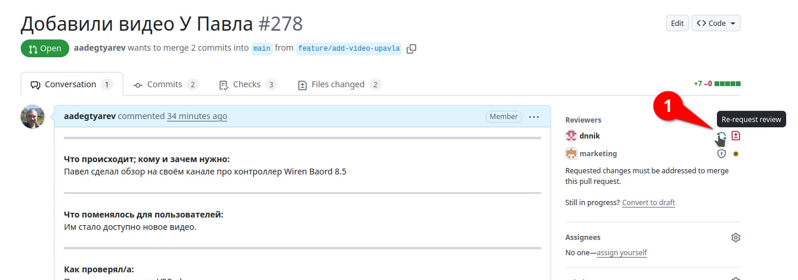

Если PR приняли:
1. Когда вам в чатике сказали «Аппрувнул», это значит разрешили вливать ваш PR в main. В интерфейсе Гитхаба готовый к вливанию PR выглядит так: 1,2,3 — зелёное, кнопка 4 зелёная доступна. Надмите на кнопку *Squash and Merge*.
    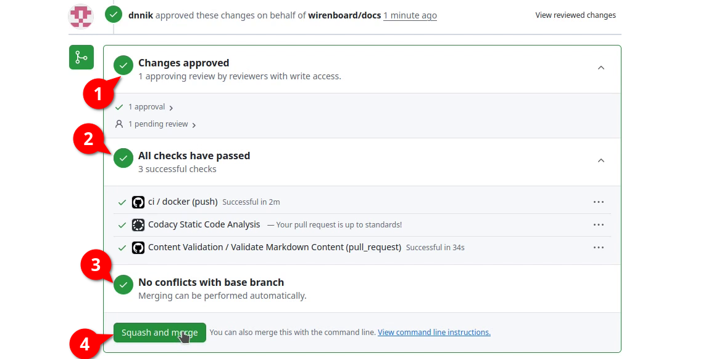
2. Теперь все ваши изменнеия будут слиты в один коммит, заполните понятное описание и заголовок. В конце нажмите кнопку *Confirm aquash and merge*.
    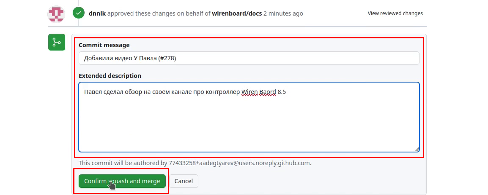
3. Ваши изменения вольются в main, веточка автоматически удалится, а PR закроется
    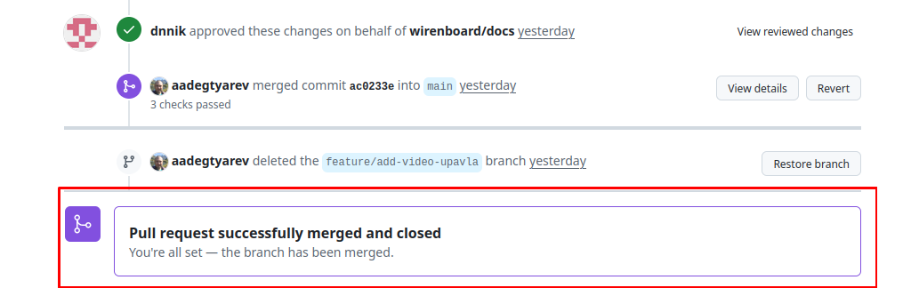

Поздравляю, вы готовы к новым правкам!