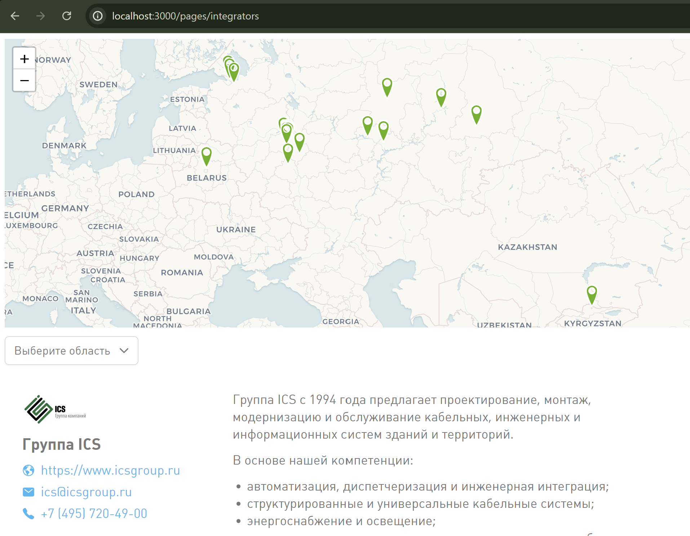

# Локальный запуск копии сайта

Тяжёлая артиллерия, показывает изменения почти как они будут на сайте в итоге. Тут имеет смысл смотреть дизайн или общие сгенерированные страницы с кучей карточек-ссылок, например, Статьи, Работа и т.п.

**Для обычного внесения правок и предпросмотра рекомендуем использовать VSCode**.

## Как пользоваться

1. Убедитесь, что Node.js и pnpm установлены.
2. В корне проекта (путь к папке не должен содержать русских букв):
   ```bash
   pnpm install
   pnpm run dev
   ```
3. Откройте браузер по адресу `http://localhost:3000` для просмотра изменений. Не забудьте ввести в адресную строку url просматриваемой страницы, например `http://localhost:3000/ru/contents/articles`.

## Особенности

Отображаться будет только контент, без остального содержимого сайта (навигации, футера и пр.).



Чтобы посмотреть, какой версии в github соответствует текущая версия сайта, можно использовать адрес `http://localhost:3000/version.txt`.
Это также будет работать, если сайт развёрнут целиком, как на https://wirenboard.com : `https://wirenboard.com/version.txt`.

По этому адресу будет доступен такой текстовый файл:

```
Base version: unknown
External version: main@d9faf525
```

В данном примере `main@d9faf525` — это версия сайта, которая соответствует текущему состоянию в репозитории. `main` - ветка, `d9faf525` - хэш коммита.