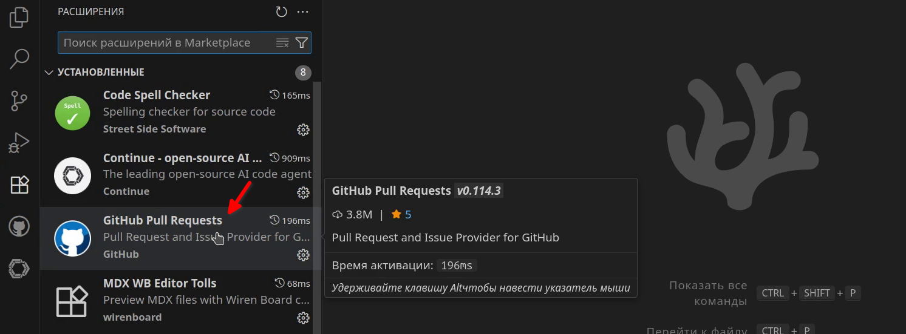
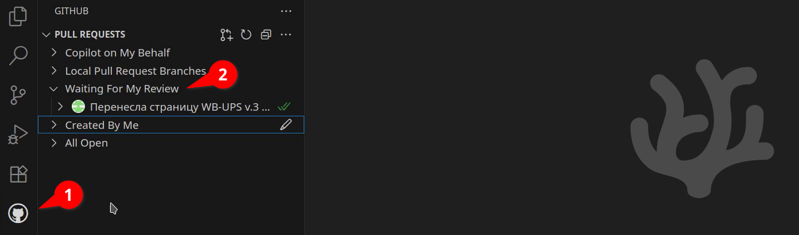
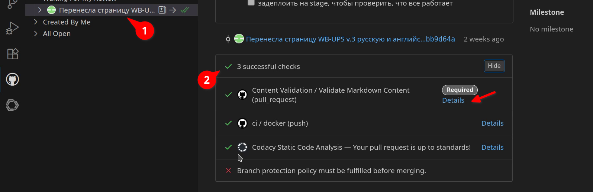
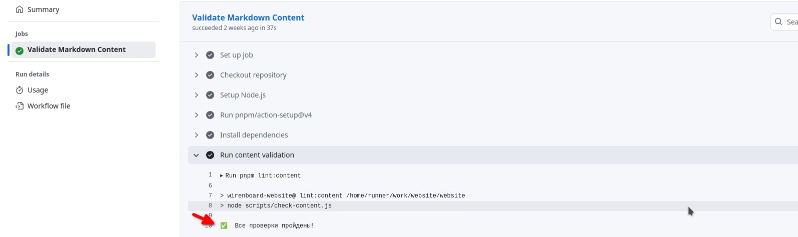
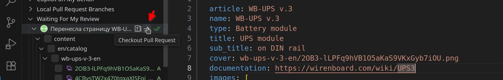
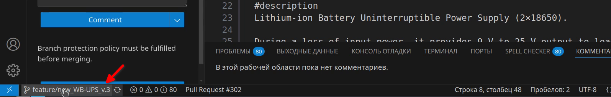
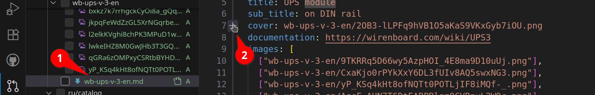
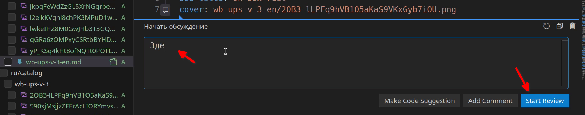
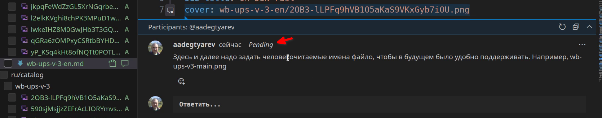

# Для ревьюверов

## Подготовка
Если вы впервые вносите правки, вам надо:
1. [Настроить рабочее окружение в VSCode](git_instruments.md).
2. [Клонировать репозиторий себе на компьютер](git_vscode.md). 

В остальных случаях просто откройте папку с репозиторием (website) в редакторе VSCode.

[Шпаргалка по Git](images/git_add_content/git-branches-2.png)

## Ревью

Проверьте, что у вас установлен плагин Github Pull Requests:
 

**Цель ревью** — проверить логику вносимых изменений, грамотность и удобство будущих правок. Об оформлении позаботится движок контента и автоматические тесты.

Теперь надо провести ревью:
1. Откройте панель плагина Github Pull Requests и разверните список Waiting For My Review:
       
2. Выберите один из пуллреквестов и убедитесь, что тесты проверяющие правильность оформления компонентов и наличие картинок пройдены. Если тест провалился, перейдите в Datails и посмотрите причины.
      
      Здесь всё хорошо, тест пройдён. Если будут ошибки, вы увидите что именно случилось.
       
4. Если изменений много, извлеките ветку из PR к себе на компьютер кнопкой Checkout Pull Request:
      
      переключились на ветку из PR:
       
5. Откройте файл из PR и в месте, где хотите оставить комментарий, нажмите «Плюсик».
       
6. Оставьте комментарий один или несколько комментариев. В первом нажмите Start Review, далее просто Add Comment.
      
      Оставленный комментарий. Pending — он не виден автору изменений, пока вы не закончили ревью.
      
7. Когда закончили оставлять комментарии, вам надо завершить ревью и выбрать: Approve — утвердить, Comment — оставить коммент или Request Changes — затребовать изменений и повторное ревью. Любое из этих действий делает видимым автору изменений ваших комментариев со статусом Pending. Кстати, увидеть комментарии к файлам можно на вкладке Комментарии.
   