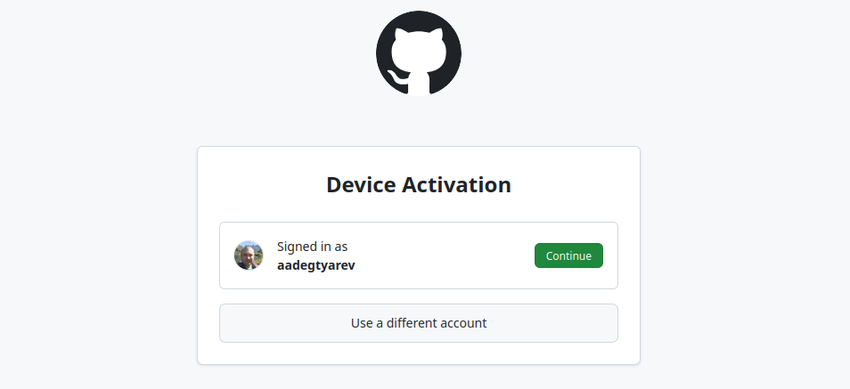

# Клонирование репозитория в VSCode

Перед тем как клонировать репозиторий, войдите под своей корпоративной учётной записью в [Github](https://github.com). Убедитесь, что вы видите свой никнейм в списке людей [организации wirenbiard](https://github.com/orgs/wirenboard/people). Это нужно, чтобы вы могли вносить изменения.

Далее:
1. Откройте окно VSCode, закройте все папки.
2. Выберите *Клонировать репозиторий → Клонировать из Github*.
    
3. Подтвердите запрос, скопируйте код и нажмите *Copy & Continue to Github*:
    
    
4. В открывнемся окне браузера нажмите сперва *Continue*
    
5. Введите скопированный в окне VSCode код
    
6. Подтвердите своё намериение связать ваш редактор VSCode и аккаунт в Гитхабе
    
7. Если всё сделано верно, получите поздравления
    
8. Вернитесь в редактор VSCode и введите имя репозитория `wirenboard/website`, нажмите на клавиатуре Enter и укажите пустую папку
    
9. Несколько минут VSCode будет клонировать репозиторий затем выдаст вопрос на открытие папки
    
10. В конце подтвердите, что доверяете авторам
    

Процесс работы с репозиторием описан в файле [git.md](git.md)